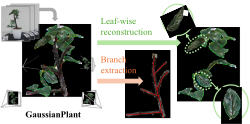

<div align="center">

# 🌱 GaussianPlant

### Structure-aligned Gaussian Splatting for 3D Reconstruction of Plants

**Yang Yang · Risa Shinoda · Hiroaki Santo · Fumio Okura**

[](https://arxiv.org/abs/2512.14087)
[](https://github.com/Yrainy0615/GaussianPlant)

<a href="http://cvl.ist.osaka-u.ac.jp/en/"></a>



</div>

> **GaussianPlant** jointly recovers a plant's **appearance** and its **structure** from
> multi-view images using 3D Gaussian Splatting. Structure primitives (StPrs) model
> branches as cylinders and leaves as disks; appearance Gaussians (AppGS) are bound to
> them and jointly optimized through a re-rendering loss. The output is a high-fidelity
> render **plus** an explicit branch skeleton and per-leaf instances — without predefined
> skeleton priors or parametric templates.

---

## Contents

- [Installation](#installation)
- [Data layout](#data-layout)
- [Pipeline](#pipeline)
  - [Step 1 — Feature 3DGS pretraining](#step-1--feature-3dgs-pretraining)
  - [Step 2 — Structure extraction](#step-2--structure-extraction-this-repo)
- [Parameters to tune](#parameters-to-tune)
- [Evaluation](#evaluation)
- [Citation](#citation)

---

## Installation

Tested on Ubuntu 22.04 with an NVIDIA RTX A6000 (CUDA 12.4, `nvcc` 12.4). The rendering
backend is [gsplat](https://github.com/nerfstudio-project/gsplat) (the original
`diff-gaussian-rasterization` is no longer required); PyTorch3D is replaced by a small
shim in `utils/pytorch3d_compat.py`. The only CUDA extensions compiled are gsplat (JIT,
on first run) and `simple-knn`.

**1. Clone (with submodules)**

```shell
git clone https://github.com/Yrainy0615/GaussianPlant.git --recursive
cd GaussianPlant
```

**2. Environment**

```shell
conda create -y -n gsplant python=3.10
conda activate gsplant

# PyTorch matching the system CUDA (12.4)
pip install torch==2.5.1 torchvision==0.20.1 --index-url https://download.pytorch.org/whl/cu124

pip install -r requirements.txt
pip install gsplat faiss-gpu-cu12 ninja
pip install "numpy<2"          # faiss pulls numpy>=2; the rest of the code needs <2
pip install --no-build-isolation ./submodules/simple-knn
```

**3. Verify**

```shell
python -c "import torch, gsplat, faiss; from simple_knn._C import distCUDA2; \
print('torch', torch.__version__, 'gsplat', gsplat.__version__, 'cuda', torch.cuda.is_available())"
```

> [!NOTE]
> gsplat compiles its kernels on first use (~90 s) and needs `nvcc` + `ninja` on `PATH`.
> If it fails with *"Ninja is required to load C++ extensions"* (common in non-login
> shells / `nohup` / cron), export the toolchain first:
> ```shell
> export CUDA_HOME=/usr/local/cuda-12.4
> export PATH=$CONDA_PREFIX/bin:$CUDA_HOME/bin:$PATH
> export LD_LIBRARY_PATH=$CUDA_HOME/lib64:$LD_LIBRARY_PATH
> ```

> [!IMPORTANT]
> The above is all **Step 2** needs. **Step 1b** uses the lightweight
> `third_party/feature-3dgs` copy vendored in this repo. It has been trimmed to the
> training code path we use and renders with `gsplat`; it no longer needs the upstream
> diff-gaussian rasterizer submodule.

---

## Data layout

Datasets live under `--root_path` (e.g. `/mnt/data/gaussianplant_data`). A scene is a
COLMAP capture plus a pretrained **feature 3DGS**:

```
<root_path>/
├── dinov3_pca.pth, dinov3_text_feats.pth      # optional DINOv3 PCA-128 assets
├── dinotxt_text_feats.pth                     # DINOtxt prompt prototypes, 1024-d
├── pretrain_clean/
│   └── <scene>_clean_pruned.ply               # plant-only feature cloud — PRODUCED, see note (StrPr/AppGS source)
└── <scene>/
    ├── sparse/0, images/, masks/, depths/     # COLMAP scene
    ├── dinov3_dim128/                         # per-view DINOv3+JaFAR feature maps, PCA-128 (Step 1a)
    ├── dinotxt_dim1024/, dinotxt_fmap/        # per-view DINOtxt patch features, 1024-d
    └── feature_pretrain*/point_cloud/iteration_30000/
        ├── point_cloud.ply                    # 3DGS + semantic feature (no label; see note)
        └── point_cloud_branch_dense.ply       # GT dense branch points — EVALUATION ONLY (not used in training)
```

> [!NOTE]
> - **`pretrain_clean/*_clean_pruned.ply` is not a given asset** — it is the feature
>   cloud with the pot/background removed, which you produce yourself: either by
>   **DBSCAN** on the feature cloud (keep the plant cluster) or by projecting the 2D
>   plant **masks** to 3D (the built-in `--rm_bg` path, `compute_plant_mask`). Pass the
>   result via `--clean_ply`, or skip it and let `--rm_bg` build it on the fly.
> - **The feature 3DGS carries no branch/leaf label.** `point_cloud.ply` stores colour
>   + the semantic feature only; the branch/leaf label is **derived in Step 2** at
>   init (`build_strpr_from_gs`, joint = colour + geometry + semantic), not loaded from
>   the pretrain.
> - **Training uses no ground truth.** Step 2 is fully self-supervised (re-rendering
>   loss against the images + feature pretrain). `point_cloud_branch_dense.ply` is read
>   **only** by `eval_chamfer.py` to score the result.

---

## Pipeline

```
 images ─▶ [1a] DINOtxt / DINOv3  ─▶ [1b] Feature-3DGS      ─▶ [2] Structure extraction
          per-view feature maps      distill → feature 3DGS    (this repo: StrPr + AppGS)
          (preprocessing)            (vendored gsplat copy)    branch skeleton + leaf instances
```

### Step 1 — Feature 3DGS pretraining

**1a · Per-view features** — the preferred text-aligned path uses DINOtxt directly:

```shell
python extract_dinotxt_features.py \
  -s <root_path>/<scene_name> \
  --image-dir images \
  --output-dir dinotxt_dim1024 \
  --feature3dgs-dir dinotxt_fmap \
  --checkpoint-dir checkpoints \
  --max-long-side 1024
```

This writes native 1024-d DINOtxt patch features and prompt prototypes. To densify
the 1024-d feature grid with JAFAR, add `--upsampler jafar --feature-long-side 128`
or another conservative output feature long side.

| asset | description |
|-------|-------------|
| `<scene>/dinotxt_dim1024/*_dinotxt_1024.pth` | GaussianPlant feature maps |
| `<scene>/dinotxt_fmap/*_fmap_CxHxW.pt` | Feature-3DGS feature maps |
| `<root_path>/dinotxt_text_feats.pth` | `[leaf, branch, background, plant]` prompt prototypes |

The legacy PCA-128 path is still available: extract DINOv3 patch features, optionally upsample with
**[JaFAR](https://github.com/PaulCouairon/JaFAR)**, PCA-reduce them to **128-d**, and
write one map per view under `<scene>/dinov3_dim128/`.

```shell
python extract_dinov3_features.py \
  -s <root_path>/<scene_name> \
  --image-dir images \
  --output-dir dinov3_dim128 \
  --feature3dgs-dir dinov3_fmap \
  --checkpoint-dir checkpoints \
  --upsampler jafar \
  --out-dim 128 \
  --fit-pca
```

**1b · Distillation** — *via the vendored Feature-3DGS training path.*
Handled by `third_party/feature-3dgs`, a trimmed local copy of
[Feature-3DGS](https://github.com/ShijieZhou-UCLA/feature-3dgs) adapted to `gsplat`.
Point it at the Step-1a feature maps (in place of its default encoder). The semantic
feature dimension is read from the saved feature maps, so there is no
`NUM_SEMANTIC_CHANNELS` rasterizer config to edit.

```shell
cd third_party/feature-3dgs
python train.py -s <scene> -m <scene>/feature_pretrain_dinotxt -f dinotxt --iterations 30000
```

**Step-2 input contract** — whatever the encoder, Step 2 only consumes:
| asset | description |
|-------|-------------|
| `feature_pretrain*/point_cloud.ply` | 3DGS with semantic feature, e.g. 1024-d DINOtxt or 128-d DINOv3 |
| `pretrain_clean/<scene>_clean_pruned.ply` | the same cloud, pot/background removed |
| `dinotxt_text_feats.pth` or `dinov3_text_feats.pth` | shared prompt/prototype assets at `--root_path` |

Prepare the Step-2 assets from the Feature-3DGS result:

```shell
python prepare_step2_assets.py \
  --ply <scene>/feature_pretrain_dinotxt/point_cloud/iteration_30000/point_cloud.ply \
  --root <root_path> \
  --scene-name <scene_name> \
  --clean-mode semantic \
  --prototype-mode semantic-refine \
  --seed-text-feats <root_path>/dinotxt_text_feats.pth \
  --text-out <root_path>/dinotxt_text_feats_semantic_refine.pth \
  --clean-out <root_path>/pretrain_clean/<scene_name>_clean_pruned.ply \
  --semantic-label-out output/semcls/<scene_name>/dinotxt_semantic_refine_label.ply
```

For the legacy PCA-128 DINOv3 path, use the same command with
`feature_pretrain`, `dinov3_text_feats.pth`, and `dinov3_text_feats_semantic_refine.pth`.
The older colour-bootstrap mode remains available by omitting `--clean-mode semantic`
and `--prototype-mode semantic-refine`.

```shell
python prepare_step2_assets.py \
  --ply <scene>/feature_pretrain/point_cloud/iteration_30000/point_cloud.ply \
  --root <root_path> \
  --scene-name <scene_name> \
  --prototype-mode semantic-refine \
  --seed-text-feats <root_path>/dinov3_text_feats.pth \
  --text-out <root_path>/dinov3_text_feats_semantic_refine.pth \
  --clean-out <root_path>/pretrain_clean/<scene_name>_clean_pruned.ply \
  --semantic-label-out output/semcls/<scene_name>/semantic_refine_label.ply
```

The semantic-refine output can be passed to Step 2 with `--text_feats_path` without
overwriting the default prompt/prototype file.

### Step 2 — Structure extraction (this repo)

Automatic pipeline: clean cloud → joint StrPr init → auto branch fraction → binding +
axis alignment + graph + isolation pruning → branch-only densification.

```shell
python train.py \
  --source_path /mnt/data/gaussianplant_data/newplant9 \
  --root_path   /mnt/data/gaussianplant_data \
  --model_path  output/newplant9/run \
  --clean_ply   pretrain_clean/newplant9_clean_pruned.ply \
  --pretrain_path feature_pretrain_dinotxt \
  --load_iteration 30000 \
  --mask_path "" \
  --feature_path "" \
  --text_feats_path dinotxt_text_feats_semantic_refine.pth \
  --label_init semantic --branch_frac -1 --cluster_size 40 \
  --reg_bind \
  --reg_axis  --lambda_axis 1.0 \
  --reg_graph --graph_from 1000 --graph_interval 50 \
  --prune_isolated --prune_from 1500 --prune_interval 500 --prune_until 4000 \
  --densify_branch --branch_split_ratio 1.5 --max_strpr_num 4000 \
  --label_lr 0 --iterations 7000 --disable_viewer
```

`--clean_ply` loads the background-removed cloud; StrPr are clustered from it and AppGS
bound to them. (Alternatively, drop `--clean_ply` and pass `--load_iteration 30000 --rm_bg`
to load the raw feature pretrain selected by `--pretrain_path` and mask the background on the fly.)
If a scene has no `masks/` directory, pass `--mask_path ""`; otherwise the loader treats
the default mask path as required and skips images without masks.
Per-view semantic feature maps are lazy-loaded: Step 2 stores their paths at startup and
only reads a `.pth` when `--reg_sem` actually requests feature supervision for that view.
With `--reg_sem`, use `--feature_cache_size N` to keep the last `N` feature maps in RAM
(`0` by default, lowest memory).

**Outputs** in `output/<scene>/run/point_cloud/iteration_7000/`:

| file | content |
|------|---------|
| `strpr.ply` | all StrPr (full Gaussians) |
| `strpr_branch.ply` | branch StrPr only |
| `branch.ply` | bound branch AppGS points (Chamfer prediction) |
| `mst.ply` | branch MST skeleton |
| `appgas.ply` | appearance Gaussians |
| `point_cloud.ply` | StrPr + AppGS merged (any 3DGS viewer) |

> [!WARNING]
> **Do not add `--reg_overlap`.** The SuGaR-style overlap regulariser minimises neighbour
> overlap by collapsing each Gaussian's cross-section, which streaks the **leaf** StrPr
> into thin needles (in-plane elongation 1.8 → ~185 on some scenes) with no benefit to the
> branch Chamfer. It is off by default — keep it off.

---

## Parameters to tune

Most defaults generalise; these are the knobs to adjust per scene (point density and
branch fraction vary by plant):

| flag | default | what it controls / when to change |
|------|:-------:|-----------------------------------|
| `--branch_frac` | `-1` (auto) | Fraction of StrPr labelled **branch**. `-1` auto-calibrates via Otsu (capped 0.15). **The one knob that doesn't always auto-generalise:** when branches are a small minority, Otsu over-estimates and hits the cap, labelling leaves as branch (symptom: high `pred2gt`/`ctr2gt`, false cylinders on foliage). Set manually `0.03`–`0.18` (e.g. newplant5 ≈ 0.05). |
| `--cluster_size` | `40` | Avg points per StrPr cluster → StrPr **count / granularity**. Smaller = more, finer StrPr. |
| `--prune_iso_factor` | `2.5` | Isolation pruning: demote a branch StrPr whose distance to its k-th nearest branch > `median × factor`. Lower → prune floaters harder. |
| `--branch_split_ratio` | `1.5` | Branch densification: split a branch StrPr when its bound AppGS spill `> ratio × cylinder length`. Lower → finer skeleton. |
| `--prune_green_z` | `0.8` | *(with `--prune_green`)* greenness z-score above which a floating StrPr is removed as a green leaf-float. |
| `--lambda_axis` | `1.0` | Strength of the branch major-axis → branch-tangent alignment. |
| `--densify_quantile` | `0.9` | *(only with generic `--densify`)* densify the top `(1-q)` fraction by gradient (gsplat grads are ~1e3× smaller, so a quantile not a fixed threshold). |

**Recommended defaults**
- `--label_lr 0` **freezes** the branch/leaf labels at their joint-init values (init AUC ≈ 0.97; letting them drift degrades the skeleton).
- Prefer `--densify_branch` (binding-driven, branch-only) over generic `--densify` (which follows photometric gradient and densifies **leaves**, not branches).

---

## Evaluation

Primary metric: Chamfer distance between the recovered branch points and the GT dense
branch cloud `point_cloud_branch_dense.ply`.

```shell
python eval_chamfer.py \
  --gt /mnt/data/gaussianplant_data/newplant9/feature_pretrain/point_cloud/iteration_30000/point_cloud_branch_dense.ply \
  --scan output/newplant9          # ranks every run, prints the best
```

---

## Citation

```bibtex
@article{yang2025gaussianplant,
  title   = {GaussianPlant: Structure-aligned Gaussian Splatting for 3D Reconstruction of Plants},
  author  = {Yang, Yang and Shinoda, Risa and Santo, Hiroaki and Okura, Fumio},
  journal = {arXiv preprint arXiv:2512.14087},
  year    = {2025}
}
```
